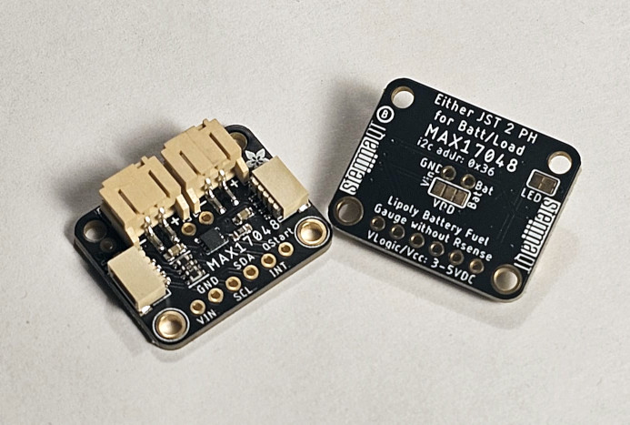

# Toit Driver Library for MAX17048/MAX17049 Battery 'Fuel Gauge' IC.

The MAX17048/MAX17049 ICs are tiny, micropower current fuel gauges for lithium-ion (Li+) batteries in handheld and portable equipment. The MAX17048 operates with a single lithium cell and the MAX17049 with two lithium cells in series.



> [!WARNING]
> The MAX17048 is powered by the connected battery, not by VIN or the STEMMA/QT connector.
> If no battery is plugged in, or the battery is too low, the MAX17048 will not respond to I2C scans or commands.

## IC Versions
The two chip versions are the same family/register map.  The practical differences are how they are wired and powered.
### MAX17048 Differences
* Built for a single lithium cell. ("S" packs).
* Powered by the lithium cell.  I2C attempts without a battery connected to the IC will appear as if the IC is not there.
* Senses on VDD - measurement range 2.5–5.0 V.
### MAX17049 Differences
* Built for two lithium cells (in series). ("2S" packs).
* Powered by the the VDD in (3/5v logic compatible)
* Senses on CELL - measurement range 5–10 V (pack voltage).
### Similarities
ModelGauge algorithm, I²C interface, alerts (VALRT, SOC threshold, 1% change), timing, and register map all share the combined datasheet. Voltage resolution 1.25 mV/cell and typical accuracy ±7.5 mV/cell are the same.

## Modes/Features
### Alerts
In this IC, alerts always latch.  Clear them with `clear-alert`.

### Temperature Compensation
For best performance, the host microcontroller must measure battery temperature periodically, and compensate the RCOMP ModelGauge parameter at least once per minute.  This can be done using `` where battery temperature must be given in celsius.  (See RCOMP)

### SOC Alert Threshold
State of Charge threshold where an interrupt is generated (on the ALRT pin) for the purposes of alerting when the battery's state of charge has reached that level - useful for ensuring the system can get itself ready for power off, etc.  It can be programmed from 1% up to 32%.

### Sleep Mode
In sleep mode, the IC halts all operations, reducing current consumption to below 1μA. After exiting sleep mode, the IC continues normal operation. In sleep mode, the IC does not detect self-discharge. If the battery changes state while the IC sleeps, the IC cannot detect it, causing SOC error. Wake up the IC before charging or discharging. To enter sleep mode:
  - First Enable sleep mode (using `set-sleep-mode-enabled true`) and then either:
    - Hold SDA and SCL logic-low for a period for tSLEEP - A rising edge on SDA or SCL wakes up the IC.
    - Use the function `sleep-now` To wake up the IC use `wake-now`.  Other communication does not wake up the IC. (By default I2C communications would up the IC.)
Applications which can tolerate 4μA should use hibernate rather than sleep mode.

### Hibernation
In the MAX1704x, Hibernation is a low-power mode where the gauge slows down (keeps tracking SoC, but with much lower activity) to save current. Typical current drops to ~3–5 µA in hibernate vs. ~23 µA in active mode. The ADC/SoC update period stretches from 250 ms during active use, to approximately 45 sseconds in hibernate mode.
- Entering:  If the discharge rate is slow enough (set using `set-hibernation-hib-threshold` and `set-hibernation-hib-threshold`) for > 6 min, the IC goes to hibernate mode.  (Value must be between 0% and 53%)
- Exiting: if at any sample the absolute difference between estimated open-circuit voltage and measured cell voltage exceeds this threshold, the IC wakes out of Hibernate. Using `set-hibernation-act-threshold` and `get-hibernation-act-threshold` set this between 0-0.31874 Volts, in increments of 1.25mV.  Practical examples of setting this would include an application with a bursty use, eg turning on a radio or something.  This value would be set to ensure that hibernation would not be disturbed by those expected voltage drops.
- Hibernate mode can be completely disabled with `set-hibernate-mode-disabled`.  To enable hibernation again, either use `set-hibernate-mode-enabled` or set the thresholds.

### Hibernation Analog Comparator
Adjusts a fast analog comparator and a slower digital ADC threshold to detect battery removal and reinsertion.
> For captive batteries, set to 2.5V. For removable batteries, set to at least 300mV below the application’s empty voltage, according to the desired reset threshold for your application.  If the comparator is enabled, the IC resets 1ms after V(cell) rises above the threshold. Otherwise, the IC resets 250ms after the V(cell) register rises above the threshold. Set TRUE to disable the analog comparator in hibernate mode to save approximately 0.5μA. [From the Datasheet]
This can be enabled/disabled using `set-hibernate-analog-comparator-enabled` and `get-hibernate-analog-comparator-enabled`.

### RCOMP
This is an 8-bit value that can be adjusted to optimize IC performance for different lithium chemistries or different operating temperatures. The datasheet states that Maxim needs to be contacted directly for instructions around optimization. `get-rcomp-value` and `set-rcomp-value` can then be used to adjust the driver.  Default value of RCOMP is 0x97.

## Experimental
Using other static values (such as battery capacity mAh or Wh) or dynamic values (such as measuring the current at the battery using an IC like the INA226) other information becomes available.
> [!IMPORTANT]
> The following functions are created somewhat experimentally.  The health and actual capacities of batteries change over time, as well as actual values varying by things like temperature and stress.  Please consider these experimental in nature.
Set the static variables using this example snippet (Establishing I2C omitted):
```Toit
  max1704x-driver = Max1704x (bus.device Max1704x.I2C_ADDRESS)
  max1704x-driver.set-design-capacity-mah 3700.0
  max1704x-driver.set-design-capacity-wh 13.7
```
and the following other experimental functions (calculations independent of the IC) are possible:
- `estimate-mah-remaining`
- `estimate-wh-remaining`
- `estimate-hours-left` (estimated using charge rate percentage)

With dynamic information (such as battery current) the following are possible:
- `estimate-hours-left` (estimated using current in amps)
- `estimate-expected-crate-pct_per_hr` (requires current in amps)
- `estimate-effective-capacity-mah` (requires current in amps)
- `estimate-state-of-health` (requires current in amps)
- `estimate-hours-to-full` (requires current in amps)

## Usage
Please see the examples folder.

## Not Implemented (yet)/To Do:
- Quickstart: allows instant 'auto-calibration' of the IC/battery.  However, due to load, its a bad idea to do this when the battery is first plugged in or if there's a lot of load on the battery.  On some devices there is also a pin dedicated to this task.
- Table Registers:  Further model optimisation can be made using these registers.  Datasheets require direct contact with Maxim for details on how to configure these. The datasheet states that "default value is appropriate for some Li+ batteries".

## Lastly:
- This driver has been written and tested with a MAX17048.
